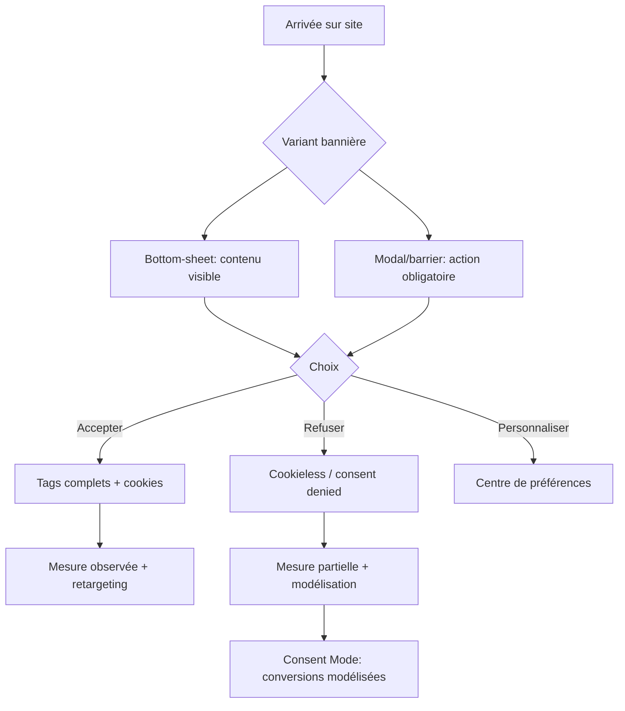
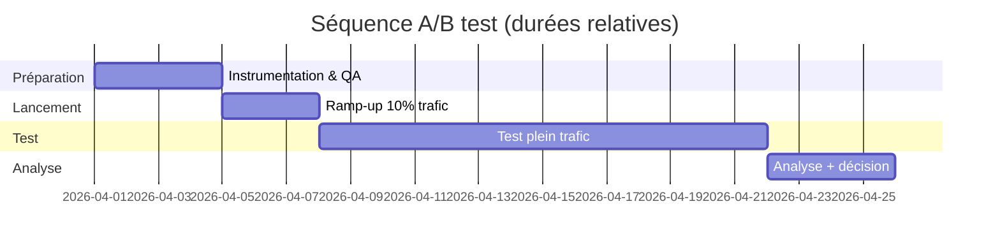

# Optimisation business d’une bannière cookies : ce que la data permet réellement de conclure

## Executive summary

Les études disponibles montrent de façon robuste que **l’architecture de choix** d’une bannière (présence d’un bouton “Tout refuser” au même niveau, effort nécessaire pour refuser, formats “banner” vs “barrier”) **change fortement les taux d’acceptation/refus**. citeturn12view1turn11view1turn25view2turn27view1

En revanche, la littérature et les cas publiés apportent **peu de preuves directes** que “plus coercitif = plus de business total” (conversion, revenu/session) **de manière généralisable**. Ce lien est souvent **supposé** (plus de tracking → meilleure optimisation), mais il est rarement mesuré proprement jusqu’au KPI business final dans des travaux publics. citeturn6view5turn9search21turn6view0

Sur le dilemme “bottom‑sheet (sticky footer) vs modal plein écran”, la donnée la plus exploitable indique surtout que **forcer l’interaction** (barrier) réduit l’“ignorance” de la pop‑up, sans démontrer un gain net systématique sur l’acceptation *à choix égal* : dans une expérience, **le style (banner vs barrier) n’affecte pas le taux de consentement des répondants**, mais le banner est **ignoré ≈3,6× plus souvent** que le barrier. citeturn12view1

Sur “bouton Refuser visible vs réduit/caché”, l’effet sur l’acceptation est, lui, **très fort** : retirer “Reject all” du premier écran **augmente la probabilité de consentement de ~22–23 points** (expérience). citeturn12view1 Une expérimentation publique française (panel ~4 000) met aussi en évidence qu’un dark pattern “effort supplémentaire pour refuser” peut faire chuter le refus d’environ **16% à ~4%** (soit −76% relatif). citeturn11view1

Mais ce levier “refus affaibli” est aussi celui qui **augmente le risque** (réputation/trust et surtout conformité). Des autorités européennes (taskforce) identifient explicitement comme problématique le fait de **mettre le refus en simple lien** (deceptive “link design”) ou d’omettre le rejet au premier niveau. citeturn27view1 La entity["organization","CNIL","french data protection authority"] a également formalisé des exemples de bannières où le rejet est un lien discret/“enfoui”, et indique des mises en conformité pour obtenir un consentement valide. citeturn6view2

Conclusion “doctrine par défaut” (business‑first, mais défendable) : privilégier **bottom sheet / barre basse** sur mobile, **première couche courte**, **3 choix visibles** (Tout accepter / Tout refuser / Personnaliser), et chercher les gains business via **qualité de mesure** (ex. Consent Mode) plutôt que via des patterns qui dégradent la validité du consentement. citeturn14view1turn27view1turn9search21turn6view0

## Cadre d’évaluation et niveaux de preuve

Pour “maximiser la performance business” (et pas uniquement le consent rate), il faut distinguer :

- **Effets UI → choix de consentement** (accept/refuse/perso, interaction, délai d’action) : souvent mesurés expérimentalement, donc assez solides. citeturn14view1turn12view1turn11view1turn25view2  
- **Effets UI → performance business totale** (bounce, scroll, CTR CTA, conversion, revenu/session) : beaucoup plus rares publiquement, et souvent confondus avec la performance web (LCP/INP/CLS), la nature du trafic, ou la qualité de tracking. citeturn6view0turn6view5turn9search21

Définition opérationnelle des niveaux de preuve (utilisée ensuite) :

| Niveau | Définition pratique |
|---|---|
| **Prouvé** | Effet observé dans expérience(s) contrôlée(s) ou mesures terrain robustes, sur métrique concernée. |
| **Probable** | Effet cohérent avec plusieurs signaux (expériences partielles, mécanisme plausible, sources convergentes), mais pas démontré systématiquement sur le KPI final. |
| **Non démontré** | Pas de preuve publique solide (ou résultats contradictoires) pour relier le design au KPI visé. |

## Résultats quantitatifs solides sur les deux leviers de design

### Ce que “bottom-sheet vs plein écran” change réellement (et ce que ça ne prouve pas)

Une grande étude terrain sur un site réel (expériences sur positions et variantes de notice) montre que **la position influence fortement l’interaction** : la position **bottom‑left** reçoit le plus d’interactions, avec **37,1% des visiteurs** interagissant avec la notice (tous devices confondus, toutes réponses confondues) dans l’expérience de position. citeturn14view1  
Cette étude discute aussi un mécanisme mobile : en bas, la notice couvre davantage le contenu et est plus facile à toucher au pouce, ce qui augmente l’interaction. citeturn13view1

Sur “banner vs barrier”, l’expérience de entity["people","Matthew Nouwens","chi 2020 author"] (pop‑ups injectées pendant la navigation) trouve que **le style de notification n’affecte pas le taux de consentement** des participants *qui répondent*, mais que **le banner est ignoré ≈3,6× plus souvent** que le barrier (donc le barrier force davantage l’action). citeturn12view1  
Ce résultat soutient une conclusion prudente : **le plein écran peut augmenter la “décision immédiate”** (moins d’ignorance), mais **n’établit pas** que cela augmente l’acceptation “utile” ni la conversion finale.

### Effet de “Reject visible vs réduit/caché” sur l’acceptation/refus

Sur ce point, l’effet est nettement plus grand et mieux établi sur la métrique consentement.

- Dans une expérience, **retirer le bouton “Reject all” de la première page** augmente la probabilité de consentement de **~22–23 points de pourcentage**. citeturn12view1  
- Dans l’expérimentation française menée avec la entity["organization","Direction interministérielle de la transformation publique","france public transformation directorate"] et le entity["organization","Behavioural Insights Team","behavioral science consultancy"] (≈4 000 participants), une bannière neutre produit **16%** de refus, mais un dark pattern “clic supplémentaire pour refuser” fait baisser ce refus de **76%**, pour atteindre environ **4%**. citeturn11view1  
  - Calcul reproductible : 16% × (1 − 0,76) = 16% × 0,24 = 3,84% ≈ 4%. citeturn11view1

À l’inverse, ces mêmes travaux montrent que des designs pro‑choix (“bright patterns”) peuvent faire monter les taux de refus/personnalisation vers **33% à 46%**. citeturn11view1

### Effets de persistance (important pour “business long terme”)

Deux sources convergent sur un point souvent ignoré dans l’optimisation “acceptation brute” : **l’effet d’un design se transfère aux choix futurs**.

- L’étude USENIX 2024 de entity["people","Nataliia Bielova","usenix security 2024 author"] conclut que l’effet des designs peut persister à court terme et influencer des choix ultérieurs même face à une bannière neutre. citeturn17view1turn18view1  
- Le rapport DITP/CNIL indique aussi que l’exposition antérieure à des dark patterns rend ensuite les individus plus enclins à accepter face à une bannière neutre, tandis que les bright patterns ont l’effet inverse. citeturn11view1

Ce point compte business‑wise : une optimisation “court terme” via coercition peut créer une norme d’usage (habituation), mais aussi accroître l’irritation, l’évitement, ou la défiance (ce dernier lien étant plus difficile à quantifier publiquement).

### Tableau de résultats quantitatifs clés (ce qu’on peut réutiliser dans un skill)

| Source | Contexte | Résultat clé (quant) | Lecture pour le design |
|---|---|---|---|
| Étude terrain (position) | Site réel, variations de position | Bottom‑left : **37,1%** d’interactions (tous choix confondus). citeturn14view1 | Le placement bas (surtout bas‑gauche) maximise l’interaction, sans nécessiter plein écran. |
| Expérience “banner vs barrier” | Pop‑ups injectées, navigation | Banner ignoré **≈3,6×** plus que barrier ; style n’affecte pas le consentement des répondants. citeturn12view1 | Plein écran → plus d’action forcée, mais pas preuve de +acceptation “utile”. |
| Expérience “Reject absent” | Pop‑ups injectées | Retirer “Reject all” (1er écran) : **+22–23 points** de consentement. citeturn12view1 | C’est le levier le plus puissant sur acceptation, mais c’est aussi celui le plus risqué. |
| Expérimentation FR (≈4 000) | Panel en ligne (France) | Bannière neutre : **16%** refus ; dark pattern extrême : **~4%** refus ; bright patterns : **33–46%** refus/perso. citeturn11view1 | “Effort pour refuser” écrase le refus ; designs pro‑choix font remonter vers préférences déclarées. |
| JRC 2016 (lab, n=602) | Achat e‑commerce simulé | Condition “implied consent/default”: **86/86** acceptent ≥1 fois (100%). Contrôle : 49/86≈57%. citeturn25view2 | “Consentement implicite” est un nudge massif sur acceptation – mais incompatible avec le standard actuel (et non recherché). |
| USENIX 2024 (≈3 947) | Expérience en ligne, multi‑exposition | Satisfaction “No decline” plus faible ; “Satisfied with the choice”: 44% vs 54% (control) ; temps ~4s (control) vs prolongation forte pour dark pattern extrême. citeturn18view1 | Les dark patterns extrêmes dégradent la satisfaction et augmentent l’effort/temps. |

## Impact sur la performance business totale, par modèle économique

### Ce qui est prouvé vs ce qui reste non démontré

La littérature publique “UX cookie banner” se concentre majoritairement sur **consentement et conformité**, pas sur “revenu/session”. Même quand conversion et conversion rate apparaissent, il s’agit souvent de cas isolés.

L’exemple le plus directement “business KPI” retrouvé ici est une expérimentation publiée par entity["company","Halbstark","digital agency germany"] (newsletter sign‑up comme conversion). Ils rapportent 32 conversions sur 1 518 sessions, soit ≈2,1%. citeturn6view5  
Calcul reproductible : (32 ÷ 1 518) × 100 = 2,11%. citeturn6view5  
Cette même source conclut que l’hypothèse “cookie banners dégradent la conversion” n’est pas confirmée dans leur expérience et suggère un effet possiblement positif (mais ils rapportent aussi p=0,39, donc non significatif dans leur test tel que décrit). citeturn6view5  
Il faut donc classer ce signal comme **probable** (et très contexte‑dépendant), pas comme preuve universelle.

Côté marketing/e‑commerce, un article académique open‑access en marketing relie le fait de consentir (donner un choix) à des variables aval (équité perçue et intention d’achat) dans un scénario où le tracking peut expliquer des variations de prix ; la conclusion de l’abstract indique que le consentement augmente l’attribution interne, la fairness perçue et in fine l’intention d’achat. citeturn39view0  
Ce résultat suggère un mécanisme possible : une bannière “qui donne un vrai choix” ne détruit pas nécessairement la propension à acheter, et peut parfois améliorer des jugements aval (ici dans un contexte de pricing). Mais c’est **un proxy** (purchase intent), pas un KPI terrain (revenu/session).

### Synthèse par business model (avec niveau de preuve)

| Business model | Bottom‑sheet vs plein écran | Reject visible vs réduit/caché | KPI business final |
|---|---|---|---|
| Publisher / ad‑supported | **Probable** que plein écran augmente “action” (moins d’ignorés), mais pas prouvé qu’il maximise revenu net. citeturn12view1turn6view0 | **Prouvé** : refuser moins accessible ↑ consentement (≈+22–23pp). citeturn12view1turn11view1 | **Non démontré** publiquement “par défaut” sur revenu/session (forte dépendance stack pub, audience, pays). |
| E‑commerce | **Probable** que bottom‑sheet limite friction (accès PV) ; plein écran force action mais peut gêner la perception de valeur. citeturn12view1turn6view0 | **Prouvé** sur consentement ; mais effet net sur achat **non démontré** en terrain public, hors proxies/études contextuelles. citeturn12view1turn39view0 | **Non démontré** (nécessite A/B local). |
| Lead‑gen / produit / SaaS | **Probable** que bottom‑sheet + design clair minimise bounce/irritation ; faible besoin de “forcer”. citeturn14view1turn6view0 | **Prouvé** sur acceptation ; mais **risque** réputation/confiance plus sensible (relation produit). Satisfaction baisse sur patterns extrêmes. citeturn18view1turn11view1 | **Probable** que la meilleure stratégie passe par la mesure (Consent Mode) plutôt que par coercition. citeturn9search21turn9search0 |

Point clé : à l’échelle “skill générique”, la data appuie surtout des décisions “safe default” sur consentement + UX (bottom placement, 3 choix visibles), mais **ne permet pas** d’affirmer qu’un modal plein écran ou un “Reject all” affaibli **maximise** systématiquement le business total.

## Performance web, mesure et retargeting : leviers alternatifs à la coercition

Une bannière cookies influence aussi la performance web (et donc potentiellement la conversion) via scripts et interactions.

L’article “best practices” de entity["organization","web.dev","google web performance site"] documente que les cookie notices peuvent impacter des Web Vitals : sur mobile elles peuvent devenir un élément majeur à l’écran (potentiellement LCP si gros bloc de texte), provoquer du CLS, et surtout créer des pics d’INP car le clic “Accept” déclenche souvent un chargement massif de scripts tiers. citeturn6view0  
Interprétation business (niveau **probable**) : plus l’UI et le déclenchement de scripts sont lourds (souvent corrélé à “grands overlays” + CMP tiers), plus on prend le risque d’une dégradation de performance perçue au moment critique (première impression et premier clic). citeturn6view0

Sur la “qualité de mesure”, l’écosystème entity["company","Google","technology company"] fournit un levier distinct : **Consent Mode**.  
- En mode “advanced”, les tags chargent avec un état de consentement par défaut (souvent “denied”) et envoient des “cookieless pings” tant que le consentement n’est pas accordé. citeturn9search0turn9search4  
- Google indique, dans sa documentation d’aide Ads, qu’en moyenne le conversion modeling via Consent Mode **récupère plus de la moitié** des parcours ad‑click→conversion perdus, et que des réglages avancés peuvent en récupérer **≈2× plus** en moyenne (affirmation vendor, donc à considérer comme **probable** et à valider sur vos données). citeturn9search21

Implication pratique : si votre motivation business pour pousser l’acceptation est “on a besoin de data pour optimiser nos campagnes”, Consent Mode est un levier **orthogonal** qui peut réduire la dépendance à des dark patterns (sans résoudre tous les cas, mais en réduisant l’écart de mesure). citeturn9search21turn9search0

## Trust, réputation et risque légal : coûts business potentiels

Les autorités européennes ciblent explicitement les patterns “Accept proéminent / Reject en lien discret / Reject absent du premier niveau”.

Le rapport de la entity["organization","European Data Protection Board","eu data protection authority group"] (taskforce cookie banners) décrit comme pratiques problématiques : absence de bouton de rejet au premier niveau (“no reject button on the first layer”) et “deceptive link design” (rejet présenté comme lien plutôt que bouton). citeturn27view0turn27view1  
Le même document cite des exemples où l’alternative au consentement est un lien “embedded in a paragraph of text” sans support visuel suffisant, considéré comme ne conduisant pas à un consentement valide. citeturn27view1

Côté France, une page de la CNIL sur les “dark patterns in cookie banners” liste des cas où l’option de rejet est un lien (couleur/taille/style) qui met disproportionnellement l’accent sur l’acceptation, où le rejet est enfoui, ou où l’acceptation est répétée. citeturn6view2  
La CNIL indique que ces bannières constituent une violation de la loi française (art. 82) et ordonne des mises en conformité pour que le consentement soit valide. citeturn6view2  
Le risque business associé n’est pas seulement “amende” : c’est aussi **ré‑ingénierie forcée**, instabilité de tracking, et coûts internes (compliance + engineering + perte de confiance).

Enfin, sur l’acceptabilité côté utilisateurs, l’étude USENIX 2024 montre une baisse de satisfaction sur les patterns les plus extrêmes (ex. “No decline”) : dans la table de satisfaction, “Satisfied with the choice” est plus bas dans ces conditions (44%) que sur la bannière contrôle (54%). citeturn18view1  
Ce n’est pas une mesure directe de churn ou de conversion, mais c’est un signal compatible avec un **coût réputationnel** potentiel.

## Recommandation par défaut, variantes concrètes et protocole A/B

### Doctrine par défaut à encoder dans un skill

> Par défaut : **bannière basse (sticky footer / bottom sheet)**, **première couche courte**, **3 choix visibles et symétriques** (Tout accepter / Tout refuser / Personnaliser), **chemin simple pour modifier/retirer le consentement**. Optimiser la performance business via **qualité de mesure (Consent Mode, instrumentation)** plutôt que via la réduction artificielle du rejet.

Cette doctrine s’aligne avec (a) le fait que le placement bas maximise l’interaction, (b) que la suppression du rejet est le plus gros levier sur acceptation mais augmente fortement le risque, et (c) que la mesure peut être améliorée via Consent Mode sans basculer dans un design coercitif. citeturn14view1turn12view1turn27view1turn9search21

### Trois variantes prêtes à implémenter (avec trade-offs attendus)

Les impacts “conversion/revenu” ci‑dessous sont des **hypothèses** (car non démontrées de manière universelle dans les sources publiques). Les impacts “consentement” sont largement fondés sur les expériences citées.

| Variante | UI | Consentement (accept) | Friction UX | Risque trust | Risque légal UE |
|---|---|---|---|---|---|
| **Balanced** | Bottom‑sheet compacte, texte court, 3 boutons égaux (accepter/refuser/personnaliser). | **Probable** consentement plus bas que dark patterns (puisque “refuser” facile). citeturn11view1 | **Faible** (aperçu de la PV). | **Faible** (choix perçu comme réel). citeturn18view1 | **Faible**. citeturn27view1turn6view2 |
| **Assertive‑clean** | Bottom‑sheet un peu plus présente (hauteur/contraste), même symétrie des boutons, micro‑copy bénéfices + lien “en savoir plus”. | **Probable** légère hausse d’interaction (placement bas fonctionne). citeturn14view1 | **Moyenne** (plus visible, mais non bloquante). | **Faible à moyen** selon ton/copy. | **Faible** si symétrie conservée. citeturn27view1 |
| **Aggressive‑borderline (encore défendable)** | Mobile : bottom‑sheet; Desktop : modal centré **non plein écran** (dim background), 3 boutons symétriques, aucune option cachée; objectif : réduire l’ignorance, sans “link design”. | **Probable** baisse d’ignorés (barrier force l’action). citeturn12view1 | **Haute** (action plus obligatoire côté desktop). | **Moyen** (intrusif). | **Moyen** si perçu comme “push” (évaluation cas‑par‑cas sur couleurs/contrastes). citeturn27view1 |

Ce que je déconseille d’encoder “par défaut” dans un skill (même si ça augmente l’acceptation) : “Reject all” en petit lien, enfoui, ou derrière un labyrinthe de personnalisation. Les gains sur consentement sont prouvés, mais vous achetez un risque légal explicite et une baisse de satisfaction. citeturn12view1turn27view1turn18view1turn6view2

### Protocole A/B test “Lost & Found” (lead‑gen / produit) : trancher sur la performance business totale

**Objectif** : mesurer l’effet net de la bannière sur (1) consentement, (2) performance web/UX, (3) conversion lead/achat, (4) qualité de mesure.

**Design expérimental** : randomisation par session (ou par utilisateur logged‑out via first‑party ID), persistance de l’assignation 30 jours, 3 cellules (Balanced vs Assertive‑clean vs Aggressive‑borderline).  
Justification : les effets peuvent persister dans le temps ; il faut éviter les mélanges d’exposition. citeturn11view1turn18view1

**Instrumentation minimale (événements)**  
- `banner_impression` (avec variant id, device, viewport)  
- `banner_interaction` (timestamp, temps depuis impression)  
- `consent_choice` (accept / reject / personalize / dismiss / no_action)  
- `prefs_open`, `prefs_save`, `consent_withdraw` (chemin de retrait)  
- KPIs UX : scroll depth, time‑to‑first‑interaction, CTA hero click, bounce (définition/outil), LCP/INP/CLS par variant (si possible). citeturn6view0  
- KPIs business : lead submit, achat, revenue, revenue/session, funnel step completion.

**Mesure/attribution**  
- Implémenter Consent Mode et comparer “observed vs modeled” conversions sur les variants (important si un variant fait baisser le consentement). citeturn9search0turn9search21  
- Vérifier l’implémentation (Tag Assistant / diagnostics) : la doc Ads prévoit des méthodes de vérification (utile pour éviter de croire à un effet UI alors que c’est un bug de tracking). citeturn9search6

**Analyse**  
- Mesurer séparément mobile/desktop : la littérature souligne que l’occupation d’écran et la performance peuvent être plus critiques sur mobile. citeturn6view0turn14view1  
- Rapport principal : (Δ conversion rate, Δ revenue/session) + IC 95% + diagnostics performance.  
- Rapport secondaire : (Δ accept rate, Δ reject rate, Δ modeled conversions, Δ INP/LCP/CLS).

**Taille d’échantillon (méthode reproductible, sans inventer vos baselines)**  
Pour une métrique binaire (conversion), l’ordre de grandeur par variante peut être estimé avec :

- Soit une approximation “2‑proportions” :  
  \(n \approx \dfrac{2 \cdot (z_{1-\alpha/2}+z_{1-\beta})^2 \cdot \bar p(1-\bar p)}{\Delta^2}\)  
  où \(\bar p\) est la conversion baseline et \(\Delta\) la MDE absolue (ex. +0,3 point).  
- Sans vos valeurs \(p\) et MDE, je ne peux pas donner un n fiable (tout chiffre serait arbitraire). Ce sont les 2 inputs à fournir pour chiffrer correctement.

**Garde‑fous compliance (UE)**  
Si vous opérez sur des utilisateurs UE, tester une variante “Reject caché / lien discret” est à considérer comme juridiquement risqué (les pratiques visées sont documentées). citeturn27view1turn6view2 Une alternative plus “business‑safe” est de tester des variations **assertives mais symétriques**, et de récupérer une partie de la mesure via Consent Mode. citeturn9search21turn27view1

**Décision “skill” sans A/B test (ce que la deep research permet de trancher aujourd’hui)**  
- **Prouvé** : cacher/affaiblir le refus augmente nettement l’acceptation (ordre de grandeur +22–23pp ; ou refus 16%→~4% sur un pattern extrême). citeturn12view1turn11view1  
- **Prouvé** : plein écran réduit les “ignorés” (action plus forcée), **sans preuve** que ça augmente l’acceptation des répondants à choix égal. citeturn12view1  
- **Non démontré** : que ces leviers maximisent systématiquement conversion/revenu/session (selon modèle économique). citeturn6view5  
- **Probable** : une stratégie “bottom‑sheet + 3 choix symétriques + mesure renforcée (Consent Mode) + performance web” est un meilleur optimum réutilisable (moins de risque légal et UX, tout en limitant la perte de mesure). citeturn14view1turn6view0turn9search21turn27view1