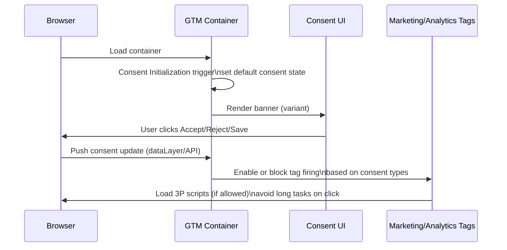

# Marketing-Optimized Cookie Banners for Conversion, Measurement, and Performance

## Executive summary

A cookie banner is a high-leverage marketing surface because it sits at the first seconds of the session (conversion friction), it gates analytics/ads instrumentation (measurement quality), and it can measurably affect Core Web Vitals (performance and indirectly SEO). citeturn24view0turn10view3turn11view2

Peer‑reviewed experiments and regulator-sponsored research show that small UX differences in consent prompts can shift outcomes by large margins (often double‑digit percentage points), especially when the design makes “decline” harder or pushes users toward a default. For example, removing a “Reject all” option from the first layer increased acceptance by ~22–23 percentage points in a controlled study; a separate randomized field trial reported banner manipulations increasing consent by 17 percentage points; and an EU JRC lab study found an implied-consent “default” condition producing 100% acceptance vs. ~57% in the control. citeturn17view0turn8view0turn23view0

However, “easy wins” that rely on asymmetric choices (e.g., burying decline in a second layer or making it hard to see) are explicitly called out by European regulators as misleading (“dark patterns”). Even if you consider legal compliance handled, these patterns are still risky from a marketing standpoint because they create user frustration, habituation, and trust erosion—costs that typically show up as higher bounce, lower conversion later in the funnel, and weaker brand sentiment. citeturn14view0turn10view4turn17view0turn11view4

A marketing-optimized (not dark-pattern) banner usually converges to: a low-friction bottom placement, a clear first layer with **three choices** (Accept all / Reject all / Settings), progressive disclosure in a preference center (category-first, vendor lists optional), strong accessibility, minimal performance footprint, and full instrumentation of the “consent funnel” so you can A/B test without corrupting analytics. citeturn12view0turn9view0turn10view2turn24view0

## Assumptions and scope

Legal compliance is assumed handled (your “skill dedicated” covers consent validity, recordkeeping, and regional requirements). This report therefore treats compliance constraints only as **anti-dark-pattern guardrails** that matter for trust and sustainable conversion, not as legal advice. citeturn10view4turn14view0turn14view1

Traffic volume, audience mix, business model (ecommerce vs. SaaS vs. media), and your current consent rates are **unspecified**. Wherever quantitative impact depends on baseline rates, sample sizes are provided as formulas plus clearly labeled illustrative examples. citeturn15search0

## Objectives and success metrics for a marketing banner

A marketing-optimized cookie banner typically targets five objectives. Each recommendation below includes rationale, expected impact, implementation notes, and trade-offs.

### Maximize useful consent

**Rationale.** The banner directly determines your effective addressable audience for analytics, remarketing, and attribution, because many tags should not set storage or run fully until consent is granted. Empirically, users overwhelmingly choose bulk options on the first layer; deeper settings are often ignored, so the first layer is where most “useful consent” is won or lost. citeturn16view4turn16view0turn23view0

**Expected impact.** Studies repeatedly show large deltas from small choice-architecture changes (often in the 10–20+ percentage point range), especially when the path to decline is made longer or hidden. Those changes can move your “consented” population enough to materially change marketing ROI. citeturn17view0turn23view0turn8view0turn26view0

**Implementation notes.** Treat “useful consent” as a vector, not a single rate: e.g., `analytics_storage`, `ad_storage`, `ad_user_data`, `ad_personalization` (if you use Google tags) often differ in business value and downstream capability. citeturn6view4turn11view2

**Trade-offs.** Pushing too hard for consent (even subtly) can raise immediate opt-in but harm trust and later conversion. Regulators explicitly describe patterns such as a hidden “refuse” link or making decline harder to find as misleading. citeturn10view4turn14view0turn17view0

### Reduce friction at entry

**Rationale.** A cookie prompt is an interruption before the user has received value. Research shows many users click simply to dismiss the prompt (“to make the window go away”), and a large share doesn’t engage with deeper controls at all. Minimizing the time-to-decision and preserving content visibility reduces abandonment risk. citeturn16view0turn17view0turn11view4

**Expected impact.** Position and format can change whether users engage with the banner at all: one large field experiment found the lower-left / lower area increases the chance users make a decision, while top placement can be ignored more. citeturn9view0

**Implementation notes.** Use a non-blocking or partially blocking pattern until the user tries to interact with gated features (if applicable), but avoid “banner fatigue” by remembering the choice and not re-prompting unnecessarily. citeturn17view0turn11view4

**Trade-offs.** A barrier modal increases decision rate but can increase bounces on unfamiliar sites; web.dev explicitly warns large modals that obscure content should be used carefully. citeturn5view4turn17view0

### Preserve measurement quality

**Rationale.** Without consent, you lose deterministic identifiers and storage-based attribution. Modern stacks mitigate this via consent-aware measurement primitives (e.g., Google Consent Mode “cookieless pings” and modeling) and/or server-side tagging as an intermediary endpoint you control. citeturn11view2turn10view1turn10view0

**Expected impact.** Moving from “no data when denied” to “cookieless pings + modeling” can materially reduce the measurement blind spot. Google distinguishes Basic vs. Advanced consent mode precisely on whether any data (including pings) is sent when consent is denied, and notes Advanced enables more detailed advertiser-specific modeling. citeturn11view2turn6view3

**Implementation notes.** Instrument the consent state early (before other tags) and update immediately when the user decides—especially before navigation/SPA transitions—so conversions are attributed correctly. citeturn5view3turn10view2

**Trade-offs.** More measurement resilience often requires more engineering (server container, event normalization) and careful governance to prevent accidental data conflicts or duplicate tagging. citeturn10view1turn10view2

### Mobile UX

**Rationale.** Mobile screens magnify banner intrusiveness and performance issues; the banner can become a large viewport element and even become the LCP candidate if it’s text-heavy. Thumb reach also matters for interaction ergonomics. citeturn12view2turn9view0turn24view0

**Expected impact.** A lower placement tends to increase the likelihood of interaction/decision on mobile (and in one large field test, also on desktop), plausibly because it aligns with common viewing and reach patterns. citeturn9view0turn12view0

**Implementation notes.** Prefer bottom sheets / footers on mobile, keep copy short, and avoid scroll locking that interferes with reading the page. citeturn12view0turn11view4

**Trade-offs.** Bottom UI can collide with mobile browser toolbars or chat widgets; test across devices and safe-area insets.

### Performance and SEO interaction effects

**Rationale.** Cookie notices often load early, are visible to all users, and can trigger heavy work when “Accept” is clicked (loading multiple third-party scripts), affecting INP and sometimes LCP/CLS. Google’s Search documentation recommends achieving good Core Web Vitals for success with Search; cookie banners are a common CLS source if they push layout after render. citeturn24view0turn12view1turn10view3

**Expected impact.** Well-implemented banners avoid layout shifts, reduce long tasks on acceptance, and prevent the consent UI itself from becoming the LCP element—especially on mobile. citeturn12view2turn12view1turn24view0

**Implementation notes.** Load scripts asynchronously, avoid DOM insertion that pushes content, and yield/segment work on “Accept” to avoid INP spikes. citeturn24view0turn12view1

**Trade-offs.** Some consent solutions rely on synchronous script blocking; web.dev notes that if synchronous scripts are required, you must optimize delivery (e.g., resource hints). citeturn24view0

## Banner variants and concrete UX design patterns

### Comparison table of banner variants

| Variant | What it is | Pros for marketing/conversion | Cons / risks | Best-use cases |
|---|---|---|---|---|
| Modal (full or large overlay) | Blocks most content until decision | Forces fast resolution; can maximize “decision rate” | Higher bounce risk on first-time visitors; can feel coercive; can increase frustration/fatigue citeturn5view4turn17view0turn11view4 | High-regulation environments where decisions must be explicit; logged-in apps; situations where features truly require a choice upfront |
| Bottom sheet (partial overlay, bottom) | Slides/appears from bottom, typically not pushing layout | Low friction; good thumb reach; often avoids CLS compared to top bars; tends to feel less “blocking” citeturn12view0turn9view0turn12view1 | Can overlap critical UI (chat, sticky CTA); needs careful safe-area handling | Most marketing sites and ecommerce landing pages; mobile-heavy traffic |
| Top bar (header notice) | Fixed or inserted at top | Visually prominent; consistent across templates | Common CLS culprit if inserted after render; can compete with nav/alerts; may be ignored more citeturn12view1turn9view0 | Sites where header is already reserved space; when you can reserve height to prevent CLS |
| Inline (in-content block) | Notice embedded into page layout | Can be non-intrusive; can be placed near trust content | Hard to integrate; may reduce visibility; uncommon in practice citeturn12view0 | Long-form content pages where you can integrate into design system without disrupting reading |
| Slide-in (corner toast / side panel) | Small panel from side or corner | Low obstruction; can preserve content view | Easy to miss; accessibility and focus management can be harder; may reduce decision rate | Returning users, logged-in dashboards, low-stakes analytics-only sites where you can accept lower immediate consent |

image_group{"layout":"carousel","aspect_ratio":"16:9","query":["cookie consent banner bottom sheet example screenshot","cookie consent modal overlay example screenshot","cookie consent top bar example screenshot","cookie preference center cookie settings panel example screenshot"],"num_per_query":1}

### The recommended “marketing-optimized but not manipulative” baseline

Below is a concrete baseline pattern designed to be A/B-tested. It is intentionally conservative on dark patterns because those tend to backfire over time and are explicitly called out by regulators as misleading (even if you’re not optimizing for legal risk). citeturn10view4turn14view0turn14view1

#### First layer structure

**Recommendation.** Use a bottom sheet (mobile) / bottom-right or bottom-center (desktop) with:

- One headline line: “Your privacy choices”
- One value line (truthful, short): “We use cookies to improve the site, measure performance, and show relevant offers.”
- Three controls: **Accept all**, **Reject all**, **Cookie settings** (or “Manage choices”)

**Rationale.** Users rarely go beyond the first layer; bulk buttons dominate choices. Making first-layer choices clear and quick reduces friction while respecting autonomy. citeturn16view0turn16view4turn11view4

**Expected impact.** Clear first-layer bulk choices align with observed behavior: in one study, 89.3% of answers used bulk options, while only 6.9% clicked “more options.” citeturn16view4turn16view0

**Implementation notes.** Keep the banner height stable; avoid late-loading fonts; use fixed positioning overlays rather than inserting DOM that pushes content. citeturn12view1turn24view0

**Trade-offs.** A visible “Reject all” can lower consent compared to “no decline on first layer” designs (research shows very large effects when decline is hidden), but those “no decline” designs are precisely what regulators label misleading and what users perceive as coercive. citeturn26view0turn14view0turn10view4

#### Preference center design

**Recommendation.** In “Cookie settings,” show **category-first** toggles with progressive disclosure:

- Necessary (locked on)
- Functional (optional depending on your setup)
- Analytics
- Marketing / Ads
- Personalization (only if truly distinct)

Vendor lists, detailed purposes, and per-partner toggles should be behind an additional “Show partners” disclosure, not the default view.

**Rationale.** Scrollable lists and deep layers are often ignored; progressive disclosure reduces cognitive load while preserving transparency for those who care. citeturn16view0turn14view1turn11view4

**Expected impact.** Presenting more granular choices on the first page is associated with lower “Accept all” rates (e.g., showing vendors on the first page reduced “accept all” clicks by ~0.20 in one controlled study, i.e., ~20 percentage points vs. bulk-only). citeturn17view0

**Implementation notes.** Record both (a) categories granted and (b) whether the user ever opened the preference center. You’ll want to know whether losses are due to “people reject” vs. “people don’t bother and pick reject/accept quickly.”

**Trade-offs.** Category-first can slightly reduce “granular” compliance purity in spirit (even if compliant in practice) and may reduce the number of users who fine-tune. But evidence suggests very few users do detailed tuning anyway (e.g., ~1.3% made a specific selection beyond bulk choices in one study). citeturn16view3turn16view4

### Copy, CTA wording, and visual hierarchy

#### CTA hierarchy that converts without dark patterns

**Recommendation.** Keep **Accept all** and **Reject all** visually symmetric (same size, contrast, and prominence). Put **Cookie settings** as a tertiary text button or a third equal button depending on your design system, but ensure it is visible and readable.

**Rationale.** Both CNIL and the EDPB Cookie Banner Taskforce explicitly describe hidden “refuse” links, embedded in paragraphs or placed outside the visual cluster of accept buttons, as problematic and misleading. Even outside legal framing, hidden actions are a trust killer. citeturn14view0turn10view4

**Expected impact.** Asymmetry can strongly change behavior: hiding “Reject all” raised acceptance by ~22–23 percentage points in one experiment; similarly, a “no decline in first layer” design drastically reduced refusal/personalization rates in a large French participant study. citeturn17view0turn26view0turn9view3

**Implementation notes.** If you want a *marketing-optimized* banner without manipulation, focus on (a) brevity, (b) clarity of benefits, and (c) not blocking content—rather than on visual tricks.

**Trade-offs.** You will likely accept a lower raw opt-in than “dark pattern” designs; the compensating benefit is better downstream trust and fewer annoyed users.

#### Ten concrete copy variants in English and French

These are **ready-to-test button sets** (Primary / Secondary / Settings). Mix and match with your headline line.

1) **EN:** Accept all / Reject all / Cookie settings  
   **FR:** Tout accepter / Tout refuser / Paramétrer

2) **EN:** Accept cookies / Reject non-essential / Manage choices  
   **FR:** Accepter / Refuser les non essentiels / Gérer mes choix

3) **EN:** Allow all / Continue without accepting / Customize  
   **FR:** Autoriser tout / Continuer sans accepter / Personnaliser

4) **EN:** Agree and continue / No thanks / Settings  
   **FR:** Accepter et continuer / Non merci / Réglages

5) **EN:** Accept & close / Reject & close / Choose cookies  
   **FR:** Accepter et fermer / Refuser et fermer / Choisir les cookies

6) **EN:** Accept all cookies / Use necessary only / More options  
   **FR:** Accepter tous les cookies / Nécessaires uniquement / Plus d’options

7) **EN:** Accept / Decline / Preferences  
   **FR:** Accepter / Refuser / Préférences

8) **EN:** OK, accept / Not now / Manage  
   **FR:** OK, j’accepte / Pas maintenant / Gérer

9) **EN:** Accept (recommended values) / Reject / Settings  
   **FR:** Accepter / Refuser / Paramètres  
   *Note: avoid “recommended” unless you can justify it; some regulators treat it as steering.* citeturn14view1turn10view4

10) **EN:** Accept all / Reject all / Learn & manage  
    **FR:** Tout accepter / Tout refuser / En savoir plus et gérer

### Placement and timing

**Recommendation.** Default to bottom placement, shown immediately on first page view (but implemented in a way that doesn’t block rendering or cause CLS). If you must use top placement, reserve space in the DOM from the start.

**Rationale.** A large field study found lower-area notices increase the chance of a decision; web.dev notes top-of-screen notices commonly cause layout shifts if inserted after render and suggests reserving space or using sticky footer/modal overlays. citeturn9view0turn12view1turn12view0

**Expected impact.** You should expect meaningful changes in interaction/decision rate from position alone, with downstream effects on consent and early-session abandonment. citeturn9view0

**Implementation notes.** Treat timing as an A/B variable only if it doesn’t cause any consent state mismatch (e.g., tags firing before choice). Your consent update must happen on the page where the user interacts, before transitions. citeturn5view3turn10view2

**Trade-offs.** “Delayed banner after X seconds/scroll” can reduce perceived friction but risks missing early consent and complicating gating.

### Accessibility requirements that also help conversion

**Recommendation.** Build the banner as an accessible component:
- Keyboard operable (Tab, Shift+Tab, Enter, Esc where appropriate)
- Correct focus order and focus trap for modal variants
- Sufficient contrast and readable text sizes
- Proper ARIA semantics for dialogs (if modal) and labels for toggles

**Rationale.** Accessibility failures convert into friction: users cannot dismiss or configure, leading to abandonment. WCAG 2.2 and ARIA Authoring Practices provide patterns for focus order and modal dialogs that prevent keyboard traps and confusion. citeturn4search1turn4search4turn4search5turn4search12

**Expected impact.** Mostly qualitative but high leverage for segments using keyboards, screen readers, and for anyone on mobile with reduced dexterity.

**Implementation notes.** If you use a full-screen modal on mobile, follow established modal dialog patterns (initial focus, escape hatch, and consistent reading order). citeturn4search12turn4search5

**Trade-offs.** Slightly more engineering time; typically worth it because it also reduces support issues and “can’t close the banner” rage-clicks.

## Experimentation playbook

### KPIs to track

Track **three layers** of KPIs; do not run banner A/B tests without guardrails.

1) **Consent funnel metrics**
- Banner impression rate (by page type)
- Interaction rate
- Choice distribution (Accept all / Reject all / Settings → Save)
- Time-to-choice
- Re-consent / change rate

Empirical work shows most behavior happens on the first layer; measuring layer transitions is key. citeturn16view0turn16view4

2) **Business conversion metrics**
- Bounce rate / engaged sessions
- Add-to-cart, lead submit, purchase
- Revenue per session / per user (if available)

3) **Measurement integrity metrics**
- Tag coverage: % sessions with analytics events, ad click IDs captured, etc.
- Conversion observation vs. modeled conversions (if using Consent Mode)
- Duplicate events rate (common when consent updates fire late)

Google’s consent docs emphasize correct default initialization and timely updates; mis-ordering can cause tags to read consent before defaults are set. citeturn10view2turn5view3turn11view2

### Five A/B test hypotheses with metrics and sample sizes

All tests assume **traffic is unspecified**; time-to-run depends on your sessions/day.

Sample size method: two-proportion test approximation (two-sided α=0.05, power=0.80). NIST provides the underlying sample size derivation approach for proportion tests using normal approximation. citeturn15search0

To compute per-variant sample size for a primary proportion metric:

\[
n \approx \frac{\left(z_{1-\alpha/2}\sqrt{2\bar p(1-\bar p)} + z_{power}\sqrt{p_1(1-p_1)+p_2(1-p_2)}\right)^2}{(p_2-p_1)^2}
\]

Where \(p_1\) is baseline, \(p_2\) is baseline + MDE, \(\bar p=(p_1+p_2)/2\). (This is the common two-proportion planning approximation; use your stats tool of choice to validate for your baseline.) citeturn15search0

**Hypothesis 1: Bottom sheet vs. top bar increases decisions without hurting conversion**
- Variant A: Top bar (reserved space)
- Variant B: Bottom sheet overlay
- Primary metric: Banner **decision rate** (any choice) within 10 seconds
- Guardrails: Bounce rate; purchase/lead CVR
- Sample size: depends on baseline decision rate.
  - Illustrative example (not your baseline): if \(p_1=0.60\) and MDE=+0.03 → compute \(n\) per variant.

**Hypothesis 2: Shorter first-layer copy improves site conversion while maintaining consent**
- A: 2 lines copy + 3 buttons
- B: 4–5 lines copy + 3 buttons
- Primary metric: Main funnel conversion (purchase/lead)
- Secondary: Consent accept rate, reject rate, time-to-choice
- Expected effect: Longer messages can reduce engagement due to limited attention; an EU JRC lab study observed that beyond acceptance, message framing changed link-click behavior, and warns about limited attention span. citeturn23view1turn22view5
- Sample size: requires your baseline CVR (often low → higher needed).

**Hypothesis 3: Button label “Manage choices” vs. “Cookie settings” increases preference-center completion**
- A: “Cookie settings”
- B: “Manage choices”
- Primary metric: Preference center **open→save completion rate**
- Guardrails: Time-to-choice; bounce rate
- Expected impact: Users rarely click deeper options; improving clarity may increase “settings” engagement. citeturn16view0turn11view4

**Hypothesis 4: Category-first preference center vs. vendor-first reduces drop-off**
- A: Vendor list immediately
- B: Categories first; vendor list behind “Show partners”
- Primary metric: Settings **save rate** (vs. abandon/close)
- Secondary: Accept all rate; reject all rate
- Expected impact: Deep lists are ignored or cause fatigue; users frequently ignore scrollable lists of purposes/vendors. citeturn16view0turn16view1

**Hypothesis 5: Performance-optimized accept flow improves INP and downstream conversion**
- A: Accept triggers immediate loading of all third-party scripts
- B: Accept yields/defers heavy work (load in phases / after next paint)
- Primary metric: Field INP on sessions where users click Accept
- Secondary: Consent accept rate; conversion rate
- Expected impact: web.dev notes “Accept” can be a particular cause of INP issues due to large processing when clicked and suggests yielding to allow the browser to paint quickly. citeturn24view0

#### Illustrative sample sizes for common consent-rate tests

The table below is **illustrative only** (your baseline and MDE are unspecified). It’s meant to help you gauge feasibility.

Assume primary metric is a proportion (e.g., “analytics consent granted”), α=0.05 two-sided, power=0.8:

- Baseline 30%, MDE 3pp → ~3,763 users per variant  
- Baseline 50%, MDE 3pp → ~4,356 users per variant  
- Baseline 70%, MDE 3pp → ~3,554 users per variant  

(Computed via the planning approximation above; update using your real baseline.) citeturn15search0

## Analytics instrumentation, consent mode, and tag architecture

### Event schema for consent analytics

You want analytics that measures the banner without relying on the very cookies being decided (where possible), and you want enough structure to debug consent-dependent tag firing. web.dev notes that some measurement tools can be blocked when users decline cookies; it also notes cookie usage is not a technical requirement for performance measurement and points to cookie-less approaches (e.g., web-vitals). citeturn12view5turn11view3

A practical event schema (names are examples):

```json
{
  "event": "consent_banner_impression",
  "properties": {
    "banner_variant_id": "bs_v3",
    "banner_type": "bottom_sheet",
    "page_type": "landing|product|checkout|blog",
    "device": "mobile|desktop",
    "locale": "en-US|fr-FR",
    "region": "EEA|non-EEA|unknown",
    "timestamp_ms": 0
  }
}
```

```json
{
  "event": "consent_choice",
  "properties": {
    "banner_variant_id": "bs_v3",
    "choice": "accept_all|reject_all|open_settings|save_settings|close",
    "time_to_choice_ms": 0,
    "consent_state": {
      "analytics": "granted|denied",
      "ads": "granted|denied",
      "personalization": "granted|denied"
    },
    "scroll_depth_before_choice": 0.0
  }
}
```

Recommended additional events:
- `consent_settings_open`
- `consent_settings_save`
- `consent_settings_cancel`
- `consent_withdraw` (from footer link)
- `consent_banner_error` (if update fails)

### Tag firing sequence and consent flows

#### Flowchart: safe default → update on choice

Google’s developer guidance is explicit: set default consent state before the user grants consent, and update based on user interaction; updates should be tracked on the page where they occur before any transition. citeturn5view3turn11view2

```mermaid
flowchart TD
  A[Page view] --> B[Set default consent state\n(e.g., denied for analytics/ads)]
  B --> C[Load banner UI]
  C --> D{User action}
  D -->|Accept all| E[Update consent: granted\nStore decision]
  D -->|Reject all| F[Update consent: denied\nStore decision]
  D -->|Open settings| G[Preference center]
  G -->|Save| H[Update consent per category\nStore decision]
  G -->|Cancel| I[No change]
  E --> J[Fire/enable tags requiring consent\nLoad 3P scripts progressively]
  F --> K[Keep tags blocked or cookieless mode\n(if configured)]
  H --> L[Fire tags for granted categories only]
```

#### Sequence diagram: Google tags + consent mode + GTM ordering

If you use Google Tag Manager, the “Consent Initialization” trigger exists to ensure consent settings are honored before other triggers fire. citeturn10view2



### Google Consent Mode and consent types

Google’s consent mode overview distinguishes **Basic** (block tags until interaction; no data sent to Google if denied) vs. **Advanced** (tags load with defaults, send cookieless pings when denied, and can enable richer modeling). citeturn11view2turn6view3

For Google Ads/measurement, consent types include `ad_storage`, `analytics_storage`, plus newer parameters such as `ad_user_data` and `ad_personalization`; Google notes `ad_user_data` is required for certain measurement use cases such as enhanced conversions and tag-based conversion tracking. citeturn6view4turn11view2

**Marketing recommendation.** If your legal/compliance setup supports it, Advanced consent mode is generally more measurement-resilient than Basic because it can send consent-state pings and support more detailed modeling when users deny storage. citeturn11view2turn6view3

**Trade-off.** Advanced consent mode is more complex to implement correctly and still requires precise alignment between CMP choices and the consent signals you send. Mis-ordering (tags reading consent before defaults) is a common failure mode; GTM’s consent initialization ordering exists to mitigate that. citeturn10view2turn5view3

### Server-side tagging as a conversion and data-quality lever

Google describes server-side tagging as using a server container as an intermediary endpoint you own, with key benefits including reduced client processing load (performance), ability to screen/modify requests for privacy, and improved data quality/normalization. citeturn10view1turn10view0

**Rationale.** From a marketing perspective, server-side tagging can:
- Reduce client-side script weight and network chatter (helping CWV and UX)
- Improve data consistency through validation/normalization
- Centralize outbound vendor requests and reduce duplication

**Expected impact.** Google’s documentation explicitly states client-side performance can improve because the browser sends one request per event to your server container, and the server container generates vendor-specific requests. citeturn10view1

**Implementation notes.**
- Start with a limited scope: route analytics + conversions first, validate parity, then expand.
- Ensure consent initialization is handled consistently if multiple containers exist; Google warns you must initialize consent in each container or consolidate for better consent management. citeturn10view1turn10view2

**Trade-offs.**
- Infra and maintenance (hosting, monitoring).
- Potential for data conflicts if parallel client + server implementations both send the same conversions.

### Fallback strategies when consent is denied

This section stays intentionally high-level because the boundary between “fallback measurement” and “circumventing consent” is legal- and implementation-dependent (and you stated legal is already handled).

Actionable, generally safer fallbacks:

- **Cookieless measurement primitives where supported** (e.g., consent mode pings and modeling) instead of trying to recreate identifiers yourself. citeturn11view2turn6view3  
- **First-party aggregated telemetry** (e.g., server logs for page requests) for coarse traffic baselines, used as directional sanity checks rather than user-level attribution.  
- **Performance RUM that does not require cookies** for CWV monitoring; web.dev notes cookies are not a technical requirement for performance measurement and points to cookie-less tooling. citeturn12view5turn11view3

## Performance, Core Web Vitals, and SEO implications

### What can go wrong

web.dev summarizes how cookie notices can affect Web Vitals:
- **LCP:** a large text-heavy notice (especially on mobile) can become the LCP element. citeturn12view2turn24view0  
- **INP:** “Accept” can trigger heavy processing by loading many third-party scripts at once. citeturn24view0  
- **CLS:** notices are a very common source of layout shifts, especially top-of-screen notices inserted after render. citeturn12view1turn12view0

Google Search Central recommends targets like LCP ≤ 2.5s, INP < 200ms, CLS < 0.1 for good user experience and explicitly recommends achieving good Core Web Vitals for success with Search and user experience generally. citeturn10view3

### Mitigation techniques that preserve conversion

**Load asynchronously and early, but intelligently.** web.dev recommends loading cookie notice scripts asynchronously and notes non-async scripts block the parser and delay LCP; it also recommends loading cookie notice scripts directly in HTML rather than injecting via tag managers to avoid delayed loading that harms performance. citeturn24view0turn24view1

**Avoid CLS by design.** Reserve space if using a top bar; otherwise use sticky footer or modal overlays so the banner does not push content when it appears. citeturn12view1turn12view0

**Reduce INP spikes on Accept.** web.dev notes the Chrome team worked with CMPs to yield after clicking accept so the browser can paint quickly; implement yielding/long-task splitting when acceptance triggers tag loading. citeturn24view0

**Use resource hints when needed.** If your banner loads from third-party origins, use `preconnect`/`dns-prefetch`; optionally `preload` if the banner is critical and you can keep it to a small number of key resources. citeturn24view1turn12view5

### SEO and intrusive interstitials

Google Search documentation explains intrusive interstitials typically obstruct content and can harm UX; however, web.dev explicitly notes Google Search does not penalize interstitials used to comply with legal regulations such as cookie banners, while intrusive usage in other contexts may be penalized. citeturn3search0turn5view4turn12view0

Marketing takeaway: cookie banners are not “SEO killers” by default, but **bad implementations** (CLS, slow LCP, INP spikes, blocked content) can degrade page experience signals and user behavior. citeturn10view3turn24view0turn12view1

## Engineering and product checklist

Use this as a “definition of done” for a marketing-optimized cookie banner.

**Product**
- Define “useful consent” targets per category (analytics vs ads vs personalization) and the business value of each.
- Define first-layer copy constraints (max lines, readability on mobile).
- Define guardrails: no hidden decline, no multi-step decline, no unreadable contrast, no repeated prompting after decline. citeturn14view0turn10view4turn14view1
- Require a persistent “Cookie settings” link in footer/header to change choices (reduces fatigue and increases trust). citeturn11view4turn17view0

**Design**
- Choose baseline variant (recommended: bottom sheet + 3 buttons).
- Ensure symmetric Accept/Reject prominence.
- Test on smallest common mobile viewport; confirm banner is not LCP-sized text block.

**Engineering**
- Implement consent defaults **before** any marketing/analytics tags run (GTM Consent Initialization if using GTM). citeturn10view2turn5view3
- Implement consent updates immediately on the same page before navigation. citeturn5view3turn11view2
- Ensure tags are gated by explicit consent types (analytics vs ads). citeturn6view4turn10view2
- Prevent CLS (reserved space or overlay). citeturn12view1turn12view0
- Prevent INP spikes on Accept (yield/phase loads; avoid loading all scripts synchronously). citeturn24view0
- Load banner scripts async; add `preconnect` if 3P origin; avoid tag-manager injection delays for the banner script when possible. citeturn24view1turn24view0
- Full accessibility pass: keyboard, focus order, ARIA patterns for modal (if used), contrast. citeturn4search1turn4search4turn4search5turn4search12

**Analytics**
- Implement consent funnel events (impression → action → choice → save).
- Monitor measurement integrity: duplicate conversions, missing consent updates.
- If using Consent Mode, confirm Basic vs Advanced behavior matches your measurement strategy. citeturn11view2turn6view3
- If server-side tagging, start with a limited subset, validate parity, then expand; ensure consent initialization consistency. citeturn10view1turn10view2

## Selected primary sources used

- CNIL statement on misleading cookie-banner dark patterns and “reject as easy as accept” examples. citeturn10view4  
- EDPB Cookie Banner Taskforce report (examples of misleading designs and button contrast issues). citeturn14view0  
- web.dev “Best practices for cookie notices” (CWV impact + mitigation patterns). citeturn24view1turn12view1turn12view0  
- Google Consent Mode docs (types, Basic vs Advanced, modeling/pings). citeturn11view2turn6view4turn5view3  
- Google Tag Manager consent mode support and consent initialization ordering. citeturn10view2  
- Google server-side tagging docs (performance/data quality/privacy controls). citeturn10view1turn10view0  
- Large-scale and experimental evidence on banner UX effects (Utz et al. 2019; Nouwens et al. 2020; Bauer et al. 2021; Bielova et al. 2024; EU JRC 2016). citeturn9view0turn17view0turn8view0turn26view0turn23view0